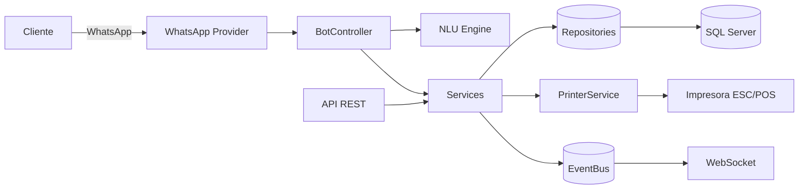

# Arquitectura

El sistema sigue **Clean Architecture** con dependencias apuntando siempre
hacia el dominio (regla de dependencia). Aplica **SOLID**, **Repository
Pattern**, **Service Pattern**, **DTO Pattern** e **Inyección de Dependencias**.

## Capas

```
┌──────────────────────────────────────────────────────────────┐
│ interfaces/  (entrega: cómo entra/sale la información)         │
│   http/  → API REST (Express): rutas, controladores, MW        │
│   ws/    → WebSocket (tiempo real)                             │
│   bot/   → Bot conversacional (máquina de estados + mensajes)  │
└───────────────▲───────────────────────────▲──────────────────┘
                │ usa                         │ usa
┌───────────────┴───────────────────────────┴──────────────────┐
│ application/ (casos de uso)                                    │
│   services/ → CatalogoService, ClienteService,                 │
│               CarritoService, PedidoService                    │
│   dto/      → ProductoDTO, PedidoDTO, ClienteDTO, CarritoDTO    │
└───────────────▲───────────────────────────▲──────────────────┘
                │ depende de abstracciones    │
┌───────────────┴───────────────────────────┴──────────────────┐
│ domain/ (núcleo, sin dependencias externas)                   │
│   entities/        → Cliente, Producto, Carrito, Pedido...     │
│   value-objects/   → Money                                     │
│   repositories/    → INTERFACES (IClienteRepository, ...)      │
│   errors/          → AppError y subtipos                       │
└───────────────▲───────────────────────────────────────────────┘
                │ implementadas por
┌───────────────┴───────────────────────────────────────────────┐
│ infrastructure/ (detalles: BD, WhatsApp, IA, impresión)        │
│   db/        → Sql* y Memory* repositories (impl. de interfaces)│
│   whatsapp/  → Baileys / CloudApi / Console providers           │
│   ai/        → RuleBasedNlu / OpenAiNluAdapter                  │
│   printing/  → EscPosEncoder, TicketBuilder, PrinterService     │
│   logger/    → pino                                             │
└────────────────────────────────────────────────────────────────┘

config/container.js  → Composition Root (cablea todo según .env)
```

## Principios SOLID aplicados

- **S** (Responsabilidad única): cada servicio/repositorio tiene un propósito.
- **O** (Abierto/Cerrado): nuevos proveedores de WhatsApp/IA/impresión se
  añaden implementando una interfaz, sin tocar el resto.
- **L** (Sustitución de Liskov): `Memory*` y `Sql*` repos son intercambiables;
  `Console/Baileys/CloudApi` providers también.
- **I** (Segregación de interfaces): interfaces de repos pequeñas y específicas.
- **D** (Inversión de dependencias): la aplicación depende de
  `domain/repositories/*` (abstracciones), no de implementaciones concretas.

## Inyección de dependencias

`config/container.js` es el único lugar que conoce las clases concretas. Elige
implementaciones según `.env` (`DB_DRIVER`, `WHATSAPP_PROVIDER`, `AI_PROVIDER`,
`PRINTER_DRIVER`) y las inyecta por constructor. Esto permite:

- Ejecutar en **modo demo** (memoria + reglas + impresión a archivo) sin
  infraestructura.
- Cambiar a **producción** (SQL Server + Baileys/Cloud + OpenAI + impresora de
  red) sin modificar la lógica de negocio.

## Flujo de un mensaje

```
WhatsAppProvider.emit('message') 
  → BotController.handle()
      → NluEngine.interpret()           (intención + ítems)
      → ClienteService / CarritoService / CatalogoService / PedidoService
          → Repositorios (SQL Server | memoria)
      → al confirmar: PedidoService
          → PedidoRepository.crear() (transacción + descuento de stock)
          → PrinterService.imprimirPedido() (ESC/POS)
          → eventBus.emit('pedido:creado') → WebSocket
  → WhatsAppProvider.sendText() (respuestas)
```

## Diagrama de componentes (Mermaid)


