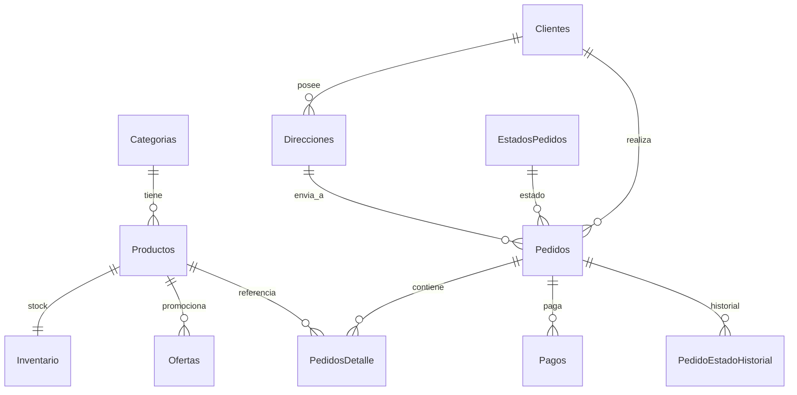

# Base de datos (SQL Server)

Scripts en [`../sql/`](../sql/), ejecutar en orden:

1. `01_schema.sql` — base de datos, tablas, PRIMARY KEY, FOREIGN KEY.
2. `02_indexes.sql` — índices.
3. `03_views.sql` — vistas (`vw_Catalogo`, `vw_PedidosResumen`).
4. `04_stored_procedures.sql` — procedimientos almacenados.
5. `05_triggers.sql` — triggers.
6. `06_seed.sql` — datos iniciales (estados, categorías, productos, etc.).

O automáticamente: `npm run db:setup` (requiere `DB_DRIVER=mssql`).

## Tablas

| Tabla | Descripción |
|---|---|
| `Configuracion` | Parámetros del negocio (nombre, envío, ITBIS). |
| `Categorias` | Categorías de productos. |
| `Productos` | Catálogo (nombre, marca, presentación, precio, keywords NLU). |
| `Inventario` | Existencia y stock mínimo por producto. |
| `Ofertas` | Precios promocionales con vigencia. |
| `Clientes` | Clientes identificados por número de WhatsApp. |
| `Direcciones` | Direcciones (principal + secundarias). |
| `EstadosPedidos` | Catálogo de estados del pedido. |
| `Pedidos` | Cabecera del pedido (totales, forma de pago, RowVersion). |
| `PedidosDetalle` | Líneas del pedido (importe calculado/persistido). |
| `Pagos` | Pagos asociados a pedidos. |
| `PedidoEstadoHistorial` | Trazabilidad de cambios de estado. |
| `Impresoras` | Configuración de impresoras térmicas. |
| `Logs` | Auditoría de eventos del sistema. |

## Procedimientos almacenados

- `sp_Cliente_GetByTelefono`, `sp_Cliente_Upsert`, `sp_Direccion_Add`
- `sp_Catalogo_List`, `sp_Producto_Buscar`, `sp_Ofertas_Vigentes`
- `sp_Pedido_Crear` (transaccional: cabecera + detalle + descuento de stock)
- `sp_Pedido_Get`, `sp_Pedido_CambiarEstado`, `sp_Pedido_Ultimo`
- `sp_Pago_Registrar`

## Triggers

- `trg_Pedidos_Estado` — registra cada cambio de estado en el historial.
- `trg_Pedidos_Touch` — actualiza `Actualizado`.
- `trg_Productos_Inventario` — crea fila de inventario al insertar un producto.
- `trg_Inventario_StockBajo` — audita stock bajo en `Logs`.

## Control de concurrencia

- `Pedidos.RowVersion` (ROWVERSION) para concurrencia optimista.
- `sp_Pedido_Crear` usa transacción con `XACT_ABORT` y descuenta inventario de
  forma atómica.

## Diagrama entidad-relación (Mermaid)

