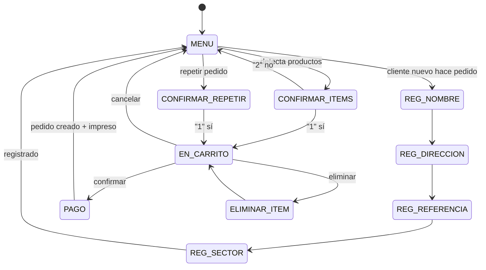

# Flujo conversacional

El bot es una **máquina de estados** (`src/interfaces/bot/SessionStore.js`)
controlada por `BotController`.

## Estados

| Estado | Qué espera |
|---|---|
| `MENU` | Cualquier intención (saludo, pedido, ofertas, consultar, repetir…). |
| `REG_NOMBRE` → `REG_DIRECCION` → `REG_REFERENCIA` → `REG_SECTOR` | Registro de cliente nuevo. |
| `CONFIRMAR_ITEMS` | "1" (sí) / "2" (no) tras detectar productos. |
| `EN_CARRITO` | Opciones del carrito (confirmar, agregar, eliminar, cancelar). |
| `ELIMINAR_ITEM` | Nombre del producto a eliminar. |
| `PAGO` | Forma de pago (1-4) para confirmar el pedido. |
| `CONFIRMAR_REPETIR` | "1"/"2" para repetir el último pedido. |

## Diagrama (Mermaid)



## Ejemplo de conversación

```
Cliente: Hola
Bot:     Bienvenido a COLMADO LA ESPERANZA. 1 Hacer pedido ... 5 Operador

Cliente: quiero dos coca cola 2L y un arroz de 10 lb
Bot:     (si es nuevo) ¿Cuál es tu nombre completo?  → registro guiado
Bot:     He encontrado: ✓ 2 Coca Cola 2L ✓ 1 Arroz 10 lb ¿Agregar? 1.Sí 2.No

Cliente: 1
Bot:     🛒 CARRITO ... TOTAL: RD$... 1.Confirmar 2.Agregar 3.Eliminar 4.Cancelar

Cliente: 1
Bot:     🧾 CONFIRMACIÓN ... Forma de pago: 1.Efectivo ...

Cliente: 1
Bot:     ✅ Pedido #1001 confirmado. (ticket impreso automáticamente)
```

## Intenciones reconocidas por el NLU

`saludo, menu, hacer_pedido, agregar, quitar, ver_carrito, confirmar, cancelar,
vaciar, ver_ofertas, consultar_pedido, repetir_pedido, catalogo, operador, si,
no, desconocido`.

El motor por reglas (`RuleBasedNlu`) funciona offline; el adaptador OpenAI
(`OpenAiNluAdapter`) mejora la comprensión y, si falla, hace *fallback* a reglas.
